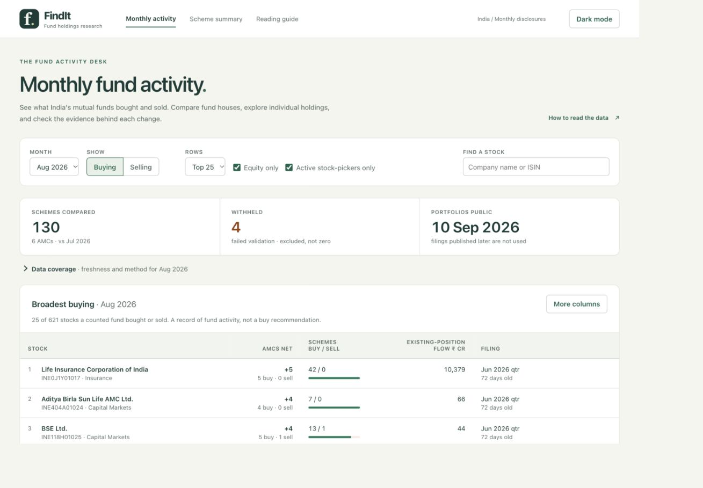
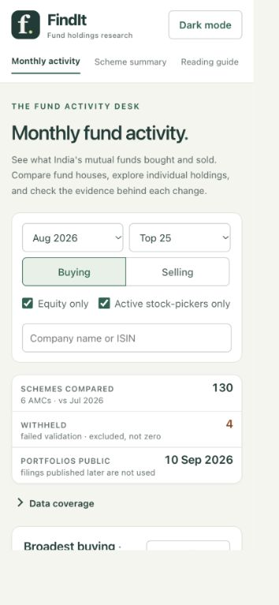

# FindIt mentor demo

FindIt shows what Indian mutual funds changed between monthly disclosures.
It counts fund houses moving in the same direction and adds quarterly
ownership filings that were available at the time. Rankings describe fund
activity; the research does not establish an investment strategy.

## Start this workspace

From the repository root:

```bash
.venv/bin/python -m findit.cli web --db real_data/mentor-ready/tracker.db
```

Open http://127.0.0.1:8000. Keep this terminal running; Ctrl+C stops it.
The server listens only on this computer unless you specify another host.
Use `--port 8001` if another application occupies port 8000.

The local presentation database is an independent SQLite copy of
`tracker.db`. ICICI's July and August 2026 source archives were reparsed with
the corrected NAV unit detection, then loaded and validated with the
pipeline. The original database and disclosures are preserved. The copy,
parsed CSVs, and intake/rebuild logs are under `real_data/mentor-ready/`.
These local data files are intentionally excluded from Git. A fresh clone
can instead follow the README's synthetic fixture quick start, or load its
own official disclosures.

## A five-minute walkthrough

1. Start with **Aug 2026**, **Buying**, **Top 25**, and both scope filters on.
   Explain that AMCs net counts fund houses, rather than treating every
   scheme from one house as an independent vote.
2. Open **Data coverage**. Show which schemes were compared and withheld,
   and the publication cutoff. A missing previous month means there is no
   comparison, not that every position is a new purchase.
3. Switch to **Selling**, then **More columns**. Existing-position flow,
   new positions, and FII/DII changes answer different questions; a high
   AMC count does not require a positive aggregate cash flow.
4. Search **Reliance** and choose **Reliance Industries Ltd.** (equity), or
   enter `INE002A01018`. Inspect the activity, fund holdings, and quarterly
   filings. ICICI's NAV weights now use percentage units, with the original
   source weights retained in the database.
5. Open **Scheme summary**, type **HDFC Large Cap**, and select the fund.
   Switch to **Jul 2026** to demonstrate that the summary follows the month
   and explains when a comparison is unavailable.
6. Return to August. Resize to a phone width or open the browser's responsive
   view; the ranking becomes readable cards. Light/dark appearance is saved
   locally. Keyboard arrows and Enter select suggestions; Escape closes a
   stock drawer and returns focus.

## Verification on 1 October 2026

- 391 passing Python tests, including ingestion, validation, ranking, publication timing,
  read-only access, web routes, and the launch command.
- Five JavaScript regressions for stale autocomplete and summary requests.
  Four reproduced failures in the previous inline script.
- Ruff, dependency compatibility, wheel build, and installed-wheel rendering across
  all 32 combinations of month, buying/selling, scope, and column mode. The
  packaged assets loaded successfully, and the database remained byte-identical.
- Desktop and phone browser checks of the flows above; no console errors
  were observed in these checks, and the phone page had no horizontal overflow.
- The prepared database passed SQLite's integrity check. The source reload
  completed, with 293 affected scheme-months passing validation.

Other schemes withheld by the existing validation rules remain visible as
withheld. First-month comparisons and missing ownership filings remain
unavailable rather than being displayed as zero. The coverage in this
workspace is a limited monthly dataset, not the entire mutual fund market.

## Design previews




